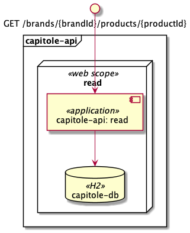

# Components diagram

The diagram shows the components of the solution.

| Componente | Tipo | Comentarios |
| :---: | :---: | --- |
| read | web scope | Scope for retrieve product prices.   |
| capitole-db | H2 | Db in memory that saves all product prices data |