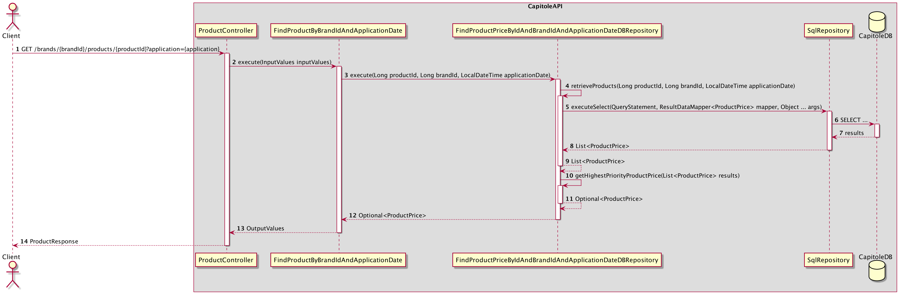
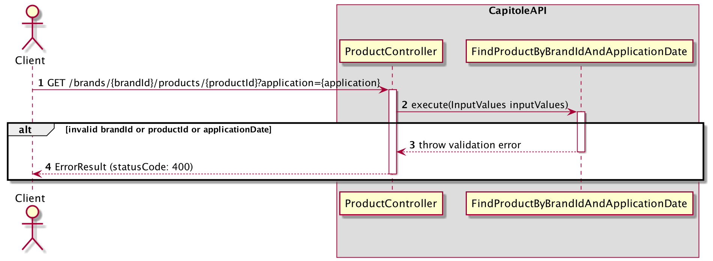
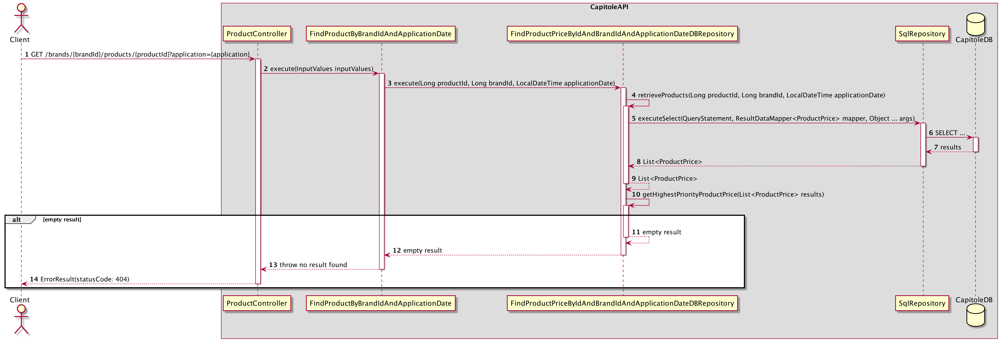
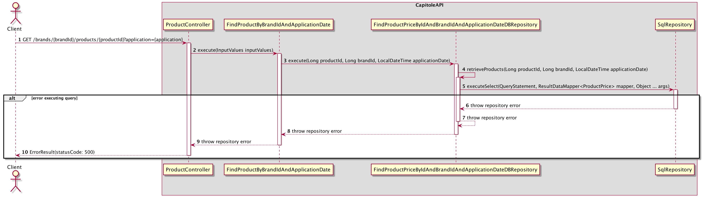
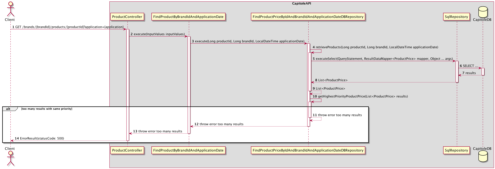

# Flows

The diagram shows the services used at different usecase of the product price API.

## GET Product price

#### Retrieve the product price info successfully - 200

1. The request to find a product price is received. 
2. Execute the usecase to find product price by brandId, productId and applicationDate.
3. Request repository layer to find the product by brandId, productId and applicationDate.
4. Call inner method to execute select query with brandId, productId and application date params.
6. Execute select query with params
7. Retrieve results
8. Retrieve results mapped
9. Retrieve results mapped
10. Request find the product price with the highest priority from results
11. Retrieve product price with the highest calculated
12. Retrieve the product price found
13. Retrieve usecase output values with product price requested
14. Map to a custom response and retrieve product price found to Client (statusCode: 200)

#### Error by mandatory fields validation - 400

1. The request to find a product price is received.
2. Execute the usecase to find product price by brandId, productId and applicationDate.
3. Some mandatory fields are not present, then throw an error.
4. Create and retrieve error response to client (statusCode: 400)

#### Product price cannot be found - 404

1. The request to find a product price is received.
2. Execute the usecase to find product price by brandId, productId and applicationDate.
3. Request repository layer to find the product by brandId, productId and applicationDate.
4. Call inner method to execute select query with brandId, productId and application date params.
6. Execute select query with params
7. Retrieve results
8. Retrieve results mapped
9. Retrieve results mapped
10. Request find the product price with the highest priority from results
11. Cannot determine a product price from empty results received, the return an empty result 
12. Retrieve the empty result
13. The result is empty then throw a not found error
14. Create and retrieve error response to client (statusCode: 404)

#### Unexpected error - 200 Ok

1. The request to find a product price is received.
2. Execute the usecase to find product price by brandId, productId and applicationDate.
3. Request repository layer to find the product by brandId, productId and applicationDate.
4. Call inner method to execute select query with brandId, productId and application date params.
6. Get an error when try to execute select query and wrap it into a repository exception and throw it.
7. Throw the last error.
8. Throw the last error
9. Wrap error in Usecase error and throw it.
10. Create and retrieve error response to client (statusCode: 500)

#### Cannot determine which product price retrieve when there are many results with the same priority - 500 Ok

1. The request to find a product price is received.
2. Execute the usecase to find product price by brandId, productId and applicationDate.
3. Request repository layer to find the product by brandId, productId and applicationDate.
4. Call inner method to execute select query with brandId, productId and application date params.
6. Execute select query with params
7. Retrieve results
8. Retrieve results mapped
9. Retrieve results mapped
10. Request find the product price with the highest priority from results
11. Cannot determine a product price to retrieve when multiple items have the same priority value, the throw a too many results error
12. Throw the last error
13. Wrap error in Usecase error and throw it.
14. Create and retrieve error response to client (statusCode: 500)
